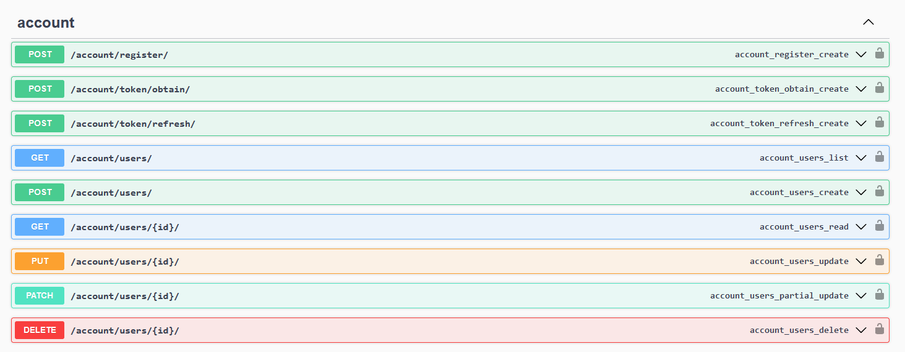
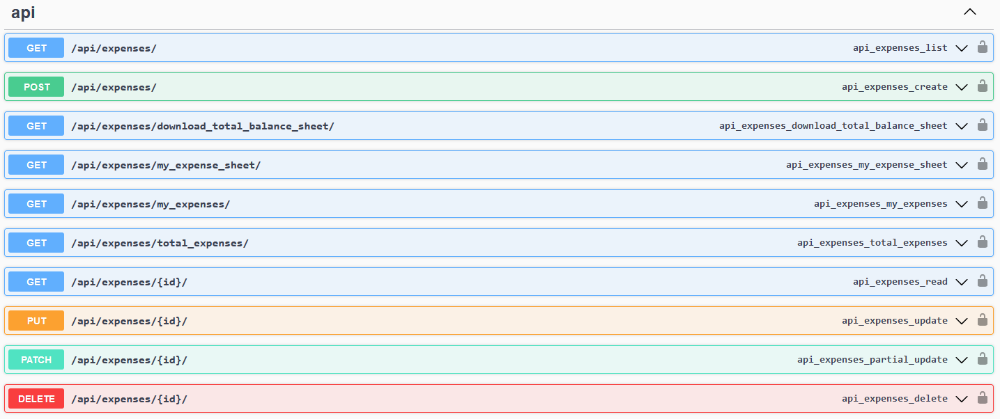

# Daily Expenses Sharing Application

## Overview

This application allows users to add expenses and split them based on three different methods: exact amounts, percentages, and equal splits. It also provides functionality to manage user details, validate inputs, and generate downloadable balance sheets.

## Features

- **User Management**: Create and retrieve user details.
- **Expense Management**: Add expenses and split them using three methods: Equal, Exact, and Percentage.
- **Balance Sheets**: Show individual expenses, overall expenses, and provide a feature to download balance sheets.

## Setup Guide

### Prerequisites

- Python 3.8+
- Django 3.2+
- Django REST Framework
- Openpyxl

### Step-by-Step Setup

1. **Clone the Repository**
   ```sh
   git clone <repository_url>
   cd <repository_directory>
   ```

2. **Create a Virtual Environment**
   ```sh
   python -m venv venv
   source venv/bin/activate  # On Windows use `venv\Scripts\activate`
   ```

3. **Install Dependencies**
   ```sh
   pip install -r requirements.txt
   ```

4. **Apply Migrations**
   ```sh
   python manage.py migrate
   ```

5. **Create a Superuser**
   ```sh
   python manage.py createsuperuser
   ```

6. **Run the Development Server**
   ```sh
   python manage.py runserver
   ```

7. **Access the Application**
   - Open your browser and navigate to `http://127.0.0.1:8000/admin/` to access the Django admin panel.
   - Use the credentials created in the previous step to log in.

### Testing
- To run tests , run the following command 
   ```sh
   python manage.py test
   ```
### Validations
- Added various validation across the application, can be found in the test cases and in the Viewset endpoints.
  
## Endpoints

### User Endpoints



**Create/Register User**: `POST /account/users/`
   - Request Body:
       ```json
       {
        "email": "admin@example.com",
        "name": "admin",
        "mobile_number": "9999988888"
        }
       ```

### Expense Endpoints



1. **Add Expense**: `POST /api/expenses/`
   - Request Body:
     - **Equal Split**:
       ```json
       {
           "description": "Dinner at restaurant",
           "total_amount": 4000,
           "split_method": "EQUAL",
           "shares": [
               {"user_id": "2d03f2ef-de89-429c-ab8e-2474cbbded5e"},
               {"user_id": "b065cbd1-4b82-433e-a0ee-caac120e5cc5"},
               {"user_id": "e6d1560f-2892-4ec2-99c3-7ede9a474714"},
               {"user_id": "f5e37576-09ad-4d2c-92ac-b1be8040371c"}
           ]
       }
       ```
     - **Exact Split**:
       ```json
       {
           "description": "Grocery shopping",
           "total_amount": 4299,
           "split_method": "EXACT",
           "shares": [
               {"user_id": "2d03f2ef-de89-429c-ab8e-2474cbbded5e", "amount": 1000},
               {"user_id": "b065cbd1-4b82-433e-a0ee-caac120e5cc5", "amount": 1500},
               {"user_id": "e6d1560f-2892-4ec2-99c3-7ede9a474714", "amount": 1799}
           ]
       }
       ```
     - **Percentage Split**:
       ```json
       {
           "description": "Party expenses",
           "total_amount": 5000,
           "split_method": "PERCENTAGE",
           "shares": [
               {"user_id": "2d03f2ef-de89-429c-ab8e-2474cbbded5e", "percentage": 40},
               {"user_id": "b065cbd1-4b82-433e-a0ee-caac120e5cc5", "percentage": 30},
               {"user_id": "e6d1560f-2892-4ec2-99c3-7ede9a474714", "percentage": 20},
               {"user_id": "f5e37576-09ad-4d2c-92ac-b1be8040371c", "percentage": 10}
           ]
       }
       ```
     - Change the `user_id` with the user id of the created users.
2. **Retrieve Logged-In User's Expenses**: `GET /api/expenses/my_expenses/`
3. **Retrieve Overall Expenses**: `GET /api/expenses/total_expenses/`
4. **Download Balance Sheet**: `GET /api/expenses/balance_sheet/`
5. **Download Logged-In User's Expense Sheet**: `GET /api/expenses/my_balance_sheet/`


### Authentication
- The application have support for `jwt-token` authentication.
- To enable it , go to `settings.py` , and update the following code - 
  ```sh
  "DEFAULT_AUTHENTICATION_CLASSES": (
    'rest_framework_simplejwt.authentication.JWTAuthentication',
    )
  ```
- The relevant endpoint for token generation can be found at the `/swagger` endpoint.
- `/account/token/obtain/` - to obtain token 
- `/account/token/refresh/` - to refresh token 

### API Documentation

You can access the API documentation at `http://127.0.0.1:8000/swagger/` 